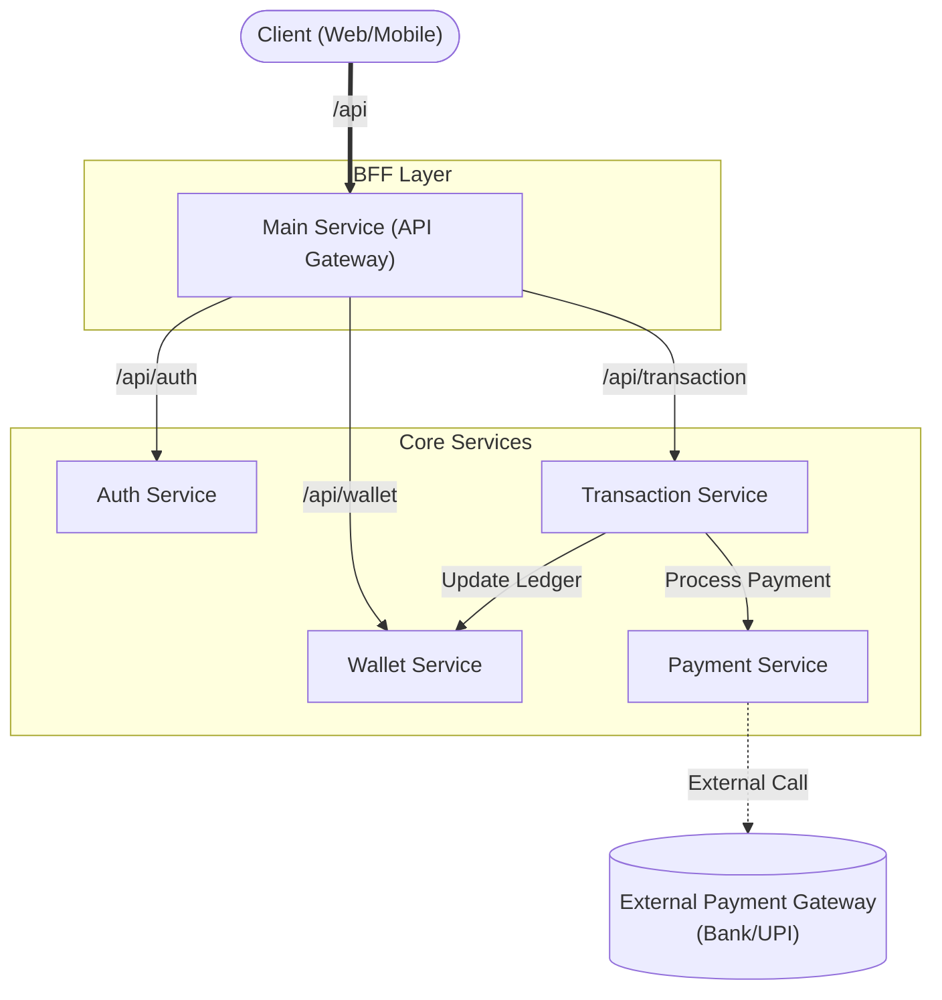
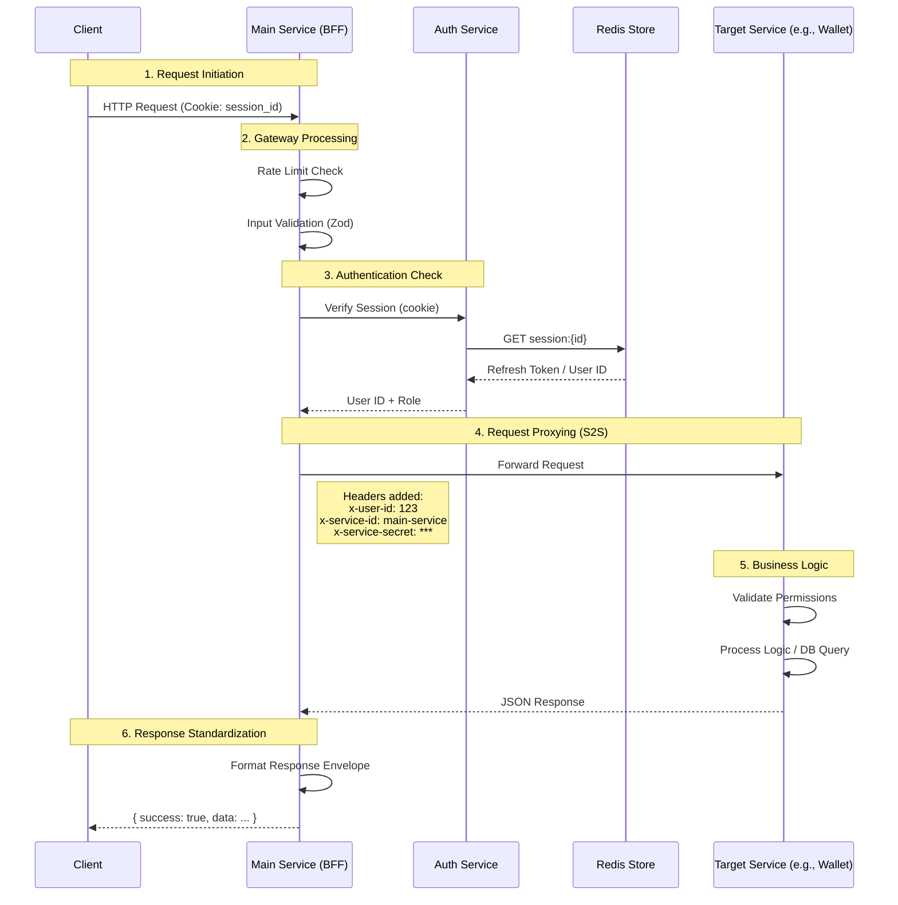
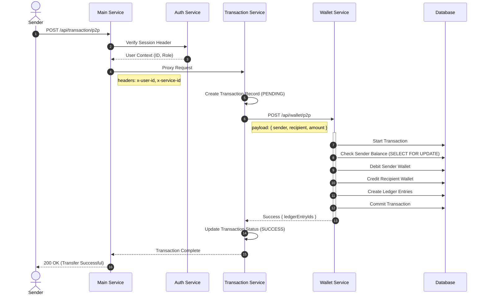
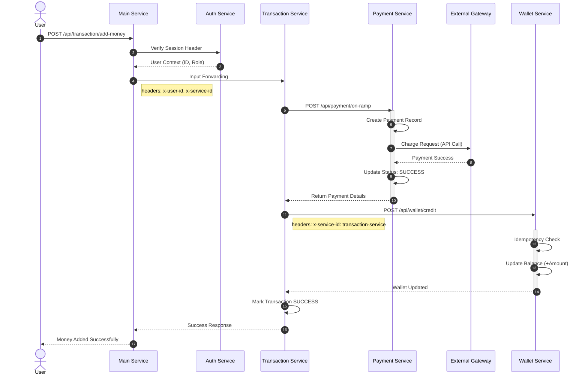

# SwiftPay System Architecture & Request Flows

This document details the architectural design and request handling patterns of the SwiftPay microservices ecosystem.

## 1. High-Level Architecture

The system follows a BFF (Backend-For-Frontend) pattern where the **Main Service** acts as a gateway and orchestrator for all client requests.

---

## 2. Request Handling & BFF Orchestration

Every request goes through the **Main Service** (BFF), which handles cross-cutting concerns before proxying to backend services.

### General Request Lifecycle

This sequence diagram demonstrates how a standard authenticated request is processed.

---

## 3. Complex Transaction Flows

### 3.1 P2P Transfer Orchestration

Peer-to-Peer transfers require coordination between **Transaction Service** (orchestrator) and **Wallet Service** (ledger).

### 3.2 On-Ramp (Deposit) Flow

Deposits involve the **Payment Service** for gateway interaction and **Wallet Service** for crediting funds.

## 4. Service-to-Service (S2S) Security

Communication between services is secured using internal headers:

- **`x-service-id`**: Identifies the calling service (e.g., `main-service`, `transaction-service`).
- **`x-service-secret`**: A shared secret key to verify the caller's identity.
- **`x-user-id`**: Propagates the authenticated user's ID context downstream.

This ensures that only authorized microservices can invoke internal APIs (like `wallet-service` operations), preventing direct unauthorized access.
